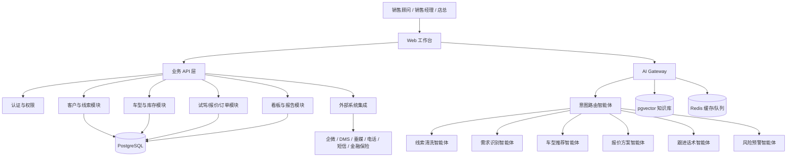
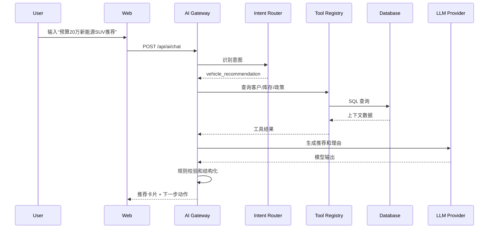

# 汽车销售智能体技术方案

## 1. 技术目标

本方案面向两个阶段：

- P0 可演示原型：基于参考房产 CRM 原型快速改造，使用前端模拟数据跑通汽车销售闭环。
- P1 可落地 MVP：形成可接入真实线索、库存、客户、报价和订单的前后端系统，并引入可控的 AI 智能体编排。

技术目标：

- 支持汽车销售核心流程：线索 -> 客户 -> 推荐 -> 跟进 -> 试驾 -> 报价 -> 订单 -> 交车 -> 报告。
- AI 能力可解释、可审计、可人工确认，避免直接承诺价格、金融审批和交付结果。
- 数据模型清晰，后续能接入 DMS、企微、垂媒、电话、短信、金融保险等外部系统。
- 架构先单体模块化，后续可拆服务，不为早期演示引入不必要复杂度。

## 2. 总体架构



推荐采用“Django 模块化单体 + AI Gateway”的架构：

- 业务后端先作为一个 Django 项目，内部按领域 app 拆分。
- AI Gateway 与业务 API 在同一后端项目内独立分层，统一管理模型调用、工具调用、RAG、审计日志和安全策略。
- 数据库先用 PostgreSQL，向量检索直接使用 pgvector，减少早期组件数量。
- 异步任务使用 Redis + Celery，负责 Excel 导入、RAG 入库、日报生成、AI 批处理和外部系统同步。

## 3. 技术选型

| 层级 | 推荐技术 | 原因 |
| --- | --- | --- |
| 前端 | React + TypeScript + Vite | 适合快速构建复杂 CRM 工作台，生态成熟 |
| UI 组件 | Ant Design 或 shadcn/ui | 表格、表单、弹窗、抽屉、筛选器等后台组件丰富 |
| 图表 | ECharts | 国内 BI/经营看板场景适配好 |
| 后端 | Django + Django REST Framework | CRM、权限、后台管理、数据模型和业务流程非常适合 |
| ORM | Django ORM + migrations | 开发效率高，后台和权限体系配套成熟 |
| 数据库 | PostgreSQL | 业务数据、JSON 扩展、全文检索都适合 |
| 向量检索 | pgvector | MVP 阶段避免单独维护向量数据库 |
| 缓存/队列 | Redis + Celery | 会话缓存、任务队列、导入任务状态、异步 AI 任务 |
| 文件存储 | 本地 MinIO 或云对象存储 | Excel、合同、报价单、知识库文档 |
| AI 编排 | 自研轻量 Orchestrator | 业务工具可控，便于审计和灰度 |
| 日志监控 | OpenTelemetry + 结构化日志 | 后续便于追踪 AI 调用和业务链路 |

P0 原型阶段可以先只做：

- Vite React 前端。
- Mock 数据和 localStorage。
- AI 接口先抽象成 `aiClient`，没有真实模型时返回模拟结果。

P1 MVP 再补齐：

- Django + DRF 后端。
- PostgreSQL 数据库。
- AI Gateway。
- Excel 导入、客户档案、车型库存、报价订单等核心 API。

## 4. 项目结构建议

```text
auto-sales-agent/
  apps/
    web/
      src/
        app/
        pages/
        components/
        features/
          dashboard/
          leads/
          customers/
          vehicles/
          recommendations/
          quotes/
          orders/
          reports/
          staff/
        services/
        mocks/
        types/
    api/
      manage.py
      config/
        settings/
        urls.py
        celery.py
      apps/
        accounts/
        tenants/
        leads/
        customers/
        vehicles/
        inventory/
        policies/
        test_drives/
        quotes/
        orders/
        tasks/
        reports/
        staff/
        integrations/
        ai_gateway/
        knowledge/
        audit/
      common/
        permissions/
        pagination/
        serializers/
        services/
      workers/
  docs/
  scripts/
  docker-compose.yml
```

如果早期只做前端演示，可以先创建 `apps/web`，把参考 HTML 中的模块拆成 React feature。等演示闭环稳定后，再补 `apps/api` 的 Django 项目。

## 5. 前端方案

### 5.1 页面模块

| 页面 | 主要组件 |
| --- | --- |
| 首页工作台 | AI 输入框、今日待办、关键指标、动态、功能入口 |
| 获客管理 | 导入向导、导入历史、线索清洗列表、重复合并、分配规则 |
| 客户档案 | 标签筛选、客户列表、客户详情抽屉、行为轨迹、AI 洞察 |
| 车辆资源 | 车型库、库存列表、试驾车排期、政策库、知识库 |
| 推荐中心 | AI 推荐卡片、车型对比、推荐理由、下一步动作 |
| 报价订单 | 报价单、优惠审批、订金、合同、金融保险、交车状态 |
| 报告中心 | 销售日报、月报、漏斗、渠道、库存、顾问绩效 |
| 员工管理 | 顾问档案、绩效排行、培训建议、权限管理 |

### 5.2 状态管理

P0：

- 页面状态使用 React state。
- 跨页面数据使用 Zustand。
- 模拟持久化使用 localStorage。

P1：

- 服务端数据使用 TanStack Query。
- 表单使用 React Hook Form + Zod。
- 权限和用户会话单独放全局 store。

### 5.3 AI 交互模式

AI 入口分三类：

- 首页自然语言入口：做意图识别和全局动作。
- 页面内 AI 助手：基于当前客户、订单或库存上下文工作。
- 表单内 AI 辅助：字段映射、摘要、话术、推荐理由、报价说明。

前端所有 AI 调用统一走：

```text
POST /api/ai/chat
POST /api/ai/actions
POST /api/ai/recommendations/vehicles
POST /api/ai/followups/generate
POST /api/ai/quotes/suggest
```

前端不要直接拼模型提示词，避免业务规则散落在页面里。

## 6. 后端模块设计

### 6.0 Django 落地约定

Django 后端建议采用“薄 ViewSet + 厚 Service + 明确 Selector”的写法：

- `models.py` 只放数据结构、约束和少量模型级方法。
- `serializers.py` 负责输入输出校验。
- `views.py` / `viewsets.py` 只处理 HTTP、权限和调用服务。
- `services.py` 负责创建、审批、状态流转、导入、报价等写操作。
- `selectors.py` 负责复杂查询和列表筛选。
- `tasks.py` 放 Celery 异步任务。
- `permissions.py` 放角色权限和数据范围权限。
- `admin.py` 配置运营后台，方便早期管理车型、库存、政策和用户。

关键三点：

- CRM、库存、报价订单这类核心业务用 Django ORM 建模，保持事务一致性。
- AI Gateway 作为独立 Django app，不直接绕过业务 service 写库。
- 长耗时任务全部进 Celery，例如 Excel 解析、知识库入库、日报生成、批量风险扫描。

### 6.1 认证与权限

能力：

- 登录、登出、刷新 Token。
- 门店/集团多租户。
- 角色权限：销售顾问、销售经理、金融保险、店总、管理员。
- 数据范围：本人客户、本组客户、本店客户、集团客户。

权限规则示例：

- 销售顾问只能查看自己负责的客户和订单。
- 销售经理可查看本组顾问数据并审批优惠。
- 店总可查看门店经营数据。
- 管理员可配置车型、政策、渠道和权限。

### 6.2 线索模块

核心能力：

- Excel/CSV 导入。
- API 接入预留。
- AI 字段映射。
- 重复线索合并。
- 有效线索评分。
- 线索分配。
- 导入任务状态追踪。

关键 API：

```text
POST /api/leads/imports
GET  /api/leads/imports/{id}
GET  /api/leads
POST /api/leads/{id}/assign
POST /api/leads/{id}/convert-to-customer
POST /api/leads/deduplicate
```

### 6.3 客户模块

核心能力：

- 客户列表和筛选。
- 客户 360 详情。
- 需求画像。
- 互动记录。
- 标签。
- AI 洞察。
- 待办任务。

关键 API：

```text
GET  /api/customers
POST /api/customers
GET  /api/customers/{id}
PATCH /api/customers/{id}
GET  /api/customers/{id}/timeline
POST /api/customers/{id}/interactions
POST /api/customers/{id}/tags
GET  /api/customers/{id}/ai-insights
```

### 6.4 车辆资源模块

核心能力：

- 品牌、车系、车型、配置管理。
- VIN 库存管理。
- 试驾车管理。
- 优惠、金融、保险、置换政策管理。
- 车型知识库。

关键 API：

```text
GET  /api/vehicle-models
GET  /api/vehicle-models/{id}
GET  /api/inventory
PATCH /api/inventory/{vin}
GET  /api/test-drive-cars
GET  /api/policies
POST /api/policies
```

### 6.5 试驾模块

核心能力：

- 查询可预约时段。
- 创建试驾预约。
- 到店签到。
- 试驾反馈。
- 试驾后跟进任务。

关键 API：

```text
GET  /api/test-drives/slots
POST /api/test-drives
PATCH /api/test-drives/{id}/status
POST /api/test-drives/{id}/feedback
```

### 6.6 报价与订单模块

核心能力：

- 生成报价单。
- 费用项配置。
- 优惠审批。
- 订金记录。
- 金融保险状态。
- 订单状态流转。
- 交车流程。
- 业绩归属。

关键 API：

```text
POST /api/quotes
GET  /api/quotes/{id}
POST /api/quotes/{id}/submit-approval
POST /api/quotes/{id}/approve
POST /api/orders
GET  /api/orders
GET  /api/orders/{id}
PATCH /api/orders/{id}/status
POST /api/orders/{id}/payments
POST /api/orders/{id}/delivery
```

### 6.7 报告模块

核心能力：

- 首页指标。
- 销售漏斗。
- 渠道分析。
- 顾问绩效。
- 库存分析。
- 日报/月报自动生成。

关键 API：

```text
GET /api/reports/dashboard
GET /api/reports/funnel
GET /api/reports/channels
GET /api/reports/staff-performance
GET /api/reports/inventory-risk
GET /api/reports/daily
GET /api/reports/monthly
```

## 7. AI Gateway 设计

### 7.1 设计原则

- 所有 AI 调用必须经过后端，前端不直接调用模型。
- 模型输出不能直接写入关键业务状态，必须由用户确认或经过规则校验。
- 每次 AI 调用记录输入摘要、使用工具、输出、耗时、用户、业务对象。
- AI 只做建议、草案、排序和摘要，价格、审批、交付承诺以业务系统为准。

### 7.2 智能体编排

AI Gateway 内部包含：

- Intent Router：识别用户意图并选择智能体。
- Context Builder：收集当前客户、库存、订单、政策和知识库上下文。
- Tool Registry：统一封装可调用工具。
- Guardrails：权限、敏感数据、价格承诺、金融合规校验。
- Response Composer：把模型结果转成前端可渲染结构。
- Audit Logger：记录调用链路。



### 7.3 工具设计

智能体可调用的工具必须是后端白名单函数。

| 工具 | 能力 |
| --- | --- |
| `search_customers` | 按标签、状态、意向车型、负责人查询客户 |
| `get_customer_profile` | 获取客户画像、互动、报价、试驾记录 |
| `search_inventory` | 按车型、预算、颜色、配置、可售状态查库存 |
| `get_vehicle_policy` | 查询优惠、金融、保险、置换政策 |
| `create_task` | 创建回访、邀约、材料补齐等待办 |
| `generate_quote_draft` | 生成报价草案，不直接生效 |
| `create_test_drive_draft` | 生成试驾预约草案，用户确认后提交 |
| `query_sales_metrics` | 查询经营指标和漏斗 |
| `retrieve_knowledge` | 从知识库检索车型、竞品、话术文档 |

### 7.4 结构化输出

AI 返回给前端建议统一结构化，避免只返回自然语言。

```json
{
  "type": "vehicle_recommendation",
  "summary": "根据客户预算和家庭用车需求，推荐 3 款新能源 SUV。",
  "cards": [
    {
      "vehicleModelId": "vm_001",
      "title": "A 品牌 X1 长续航版",
      "priceRange": "18.8-21.2 万",
      "inventoryStatus": "现车",
      "matchScore": 92,
      "reasons": ["预算匹配", "后排空间大", "本店有现车", "支持金融贴息"],
      "risks": ["白色库存仅 1 台"],
      "actions": ["generate_quote", "book_test_drive", "send_wechat_script"]
    }
  ],
  "nextBestActions": [
    {
      "action": "book_test_drive",
      "label": "预约周末试驾",
      "priority": "high"
    }
  ]
}
```

## 8. RAG 知识库方案

知识库用于车型手册、竞品对比、金融保险 FAQ、销售话术和交付流程。

处理流程：

1. 上传文档：PDF、Word、Excel、Markdown。
2. 文本抽取：保留标题、页码、表格、来源。
3. 分块：按标题和语义分块，避免跨车型混合。
4. 向量化：写入 `knowledge_chunks`。
5. 检索：按门店、品牌、车型、文档类型过滤。
6. 引用：AI 输出时带来源文档和片段标识。

关键表：

```text
knowledge_documents
knowledge_chunks
knowledge_tags
```

检索策略：

- 先用结构化过滤缩小范围，例如品牌、车系、政策有效期。
- 再做向量检索。
- 对价格、政策、库存相关问题优先查结构化数据库，不依赖知识库文本。

## 9. 数据库核心表

### 9.1 租户与权限

```text
tenants
stores
users
roles
permissions
user_store_roles
```

### 9.2 客户与线索

```text
lead_sources
lead_import_jobs
leads
lead_duplicate_candidates
customers
customer_tags
customer_tag_links
demand_profiles
interactions
tasks
```

### 9.3 车辆与政策

```text
brands
vehicle_series
vehicle_models
vehicle_trims
vehicle_inventory
test_drive_cars
sales_policies
finance_policies
insurance_products
trade_in_rules
```

### 9.4 销售流程

```text
test_drives
quotes
quote_items
quote_approval_records
orders
order_payments
finance_applications
insurance_applications
delivery_checklists
performance_attributions
```

### 9.5 AI 与审计

```text
ai_conversations
ai_messages
ai_tool_calls
ai_outputs
ai_feedback
audit_logs
```

## 10. 关键状态机

### 10.1 客户阶段

```text
new_lead
qualified
contacted
invited
test_drive_booked
test_driven
quoted
deposit_paid
contract_signed
delivered
lost
```

### 10.2 订单阶段

```text
draft
pending_discount_approval
approved
deposit_paid
finance_pending
contract_signed
final_payment_pending
ready_for_delivery
delivered
completed
cancelled
```

状态变更必须记录：

- 操作人。
- 操作时间。
- 前后状态。
- 关联单据。
- 备注。

## 11. 集成方案

### 11.1 企微

能力：

- 客户外部联系人同步。
- 标签同步。
- 聊天记录摘要接入，按合规配置启用。
- 一键发送话术草稿。

### 11.2 垂媒和广告线索

能力：

- Webhook/API 接入。
- 来源渠道和活动归因。
- 线索去重。
- 首响 SLA 监控。

### 11.3 DMS/库存系统

能力：

- 车型和 VIN 库存同步。
- 订单状态同步。
- 交车状态同步。
- 价格和政策定时同步。

### 11.4 电话/短信

能力：

- 外呼记录。
- 通话摘要。
- 短信模板发送。
- 回访结果入库。

### 11.5 金融保险

能力：

- 金融方案查询。
- 材料清单。
- 审批状态回传。
- 保险报价结果回传。

## 12. 安全与合规

安全控制：

- 多租户隔离。
- 行级权限。
- 敏感字段脱敏：手机号、身份证、金融材料。
- 操作审计。
- AI 调用审计。
- 文件上传类型和病毒扫描。
- 重要操作二次确认。

AI 合规：

- 禁止 AI 直接承诺最终价格、金融审批、保险条款和交车日期。
- 金融保险相关输出必须加“以审批结果为准”的业务标识。
- 发送给客户的话术必须由顾问确认。
- 管理员可配置禁用词、敏感词和品牌合规话术。

## 13. 部署方案

### 13.1 开发环境

```text
Web:       http://localhost:5173
API:       http://localhost:8000
Postgres:  localhost:5432
Redis:     localhost:6379
MinIO:     localhost:9000
```

使用 `docker-compose` 启动依赖服务，前后端本地运行。

### 13.2 测试环境

- Web 静态资源部署到对象存储或 Nginx。
- API 使用容器部署。
- PostgreSQL 和 Redis 使用独立实例。
- 开启结构化日志和 AI 调用审计。

### 13.3 生产环境

- 前端 CDN。
- API 多副本。
- Worker 独立副本。
- PostgreSQL 主备和自动备份。
- Redis 高可用。
- 对象存储。
- 全链路日志、指标和告警。

## 14. P0 实施计划

目标：2 到 3 周内完成可演示汽车销售智能体原型。

### 第 1 阶段：前端基础

- 创建 React/Vite 项目。
- 搭建首页工作台。
- 搭建 Mock 数据层。
- 从参考 HTML 抽取核心页面结构。

### 第 2 阶段：汽车业务替换

- 客户档案汽车化。
- 资源管理替换为车型库和库存库。
- 房源推荐替换为车型推荐。
- 合同订单替换为报价和订单。
- 待办任务替换为试驾、报价、订金、交车。

### 第 3 阶段：AI 演示闭环

- 首页 AI 输入识别 5 类意图：车型推荐、客户筛选、话术生成、库存查询、经营分析。
- 推荐卡片可生成报价和试驾预约。
- 客户详情可生成跟进话术。
- 报告中心展示模拟经营分析。

## 15. P1 实施计划

目标：6 到 8 周完成 MVP。

### 第 1 阶段：后端基础

- Django + DRF 项目。
- PostgreSQL schema 和 Django migrations。
- 用户、门店、权限。
- 客户、线索、库存、报价订单 API。

### 第 2 阶段：数据接入

- Excel 导入。
- 字段映射。
- 去重合并。
- 库存导入。
- 政策导入。

### 第 3 阶段：AI Gateway

- 意图路由。
- 工具调用。
- 车型推荐。
- 话术生成。
- 线索清洗。
- 调用审计。

### 第 4 阶段：业务闭环

- 试驾预约。
- 报价单。
- 优惠审批。
- 订金和订单。
- 交车任务。
- 看板和日报。

## 16. 风险与应对

| 风险 | 应对 |
| --- | --- |
| 库存和价格实时性不足 | 价格和库存必须来自结构化数据源，AI 只负责解释和推荐 |
| AI 输出不可控 | 使用结构化输出、工具白名单、规则校验、人工确认 |
| 销售顾问不愿使用 | 首页围绕待办和下一步动作设计，减少录入负担 |
| 数据质量差 | 导入阶段做字段映射、去重、有效性评分和人工复核 |
| 外部系统接入周期长 | P1 支持 Excel/API 双路径，先用导入跑通业务 |
| 权限复杂 | 先实现门店和角色级权限，再补细粒度数据范围 |

## 17. 第一版接口优先级

P0 前端可先 Mock，P1 后端优先实现：

1. `GET /api/dashboard/summary`
2. `GET /api/customers`
3. `GET /api/customers/{id}`
4. `POST /api/leads/imports`
5. `GET /api/inventory`
6. `POST /api/ai/recommendations/vehicles`
7. `POST /api/ai/followups/generate`
8. `POST /api/test-drives`
9. `POST /api/quotes`
10. `GET /api/orders`

这些接口能支撑第一条完整演示链路：导入线索 -> 客户建档 -> AI 推荐 -> 话术 -> 试驾 -> 报价 -> 订单 -> 看板。
