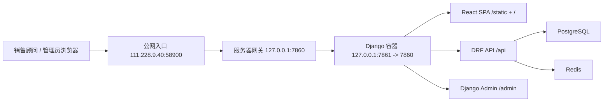
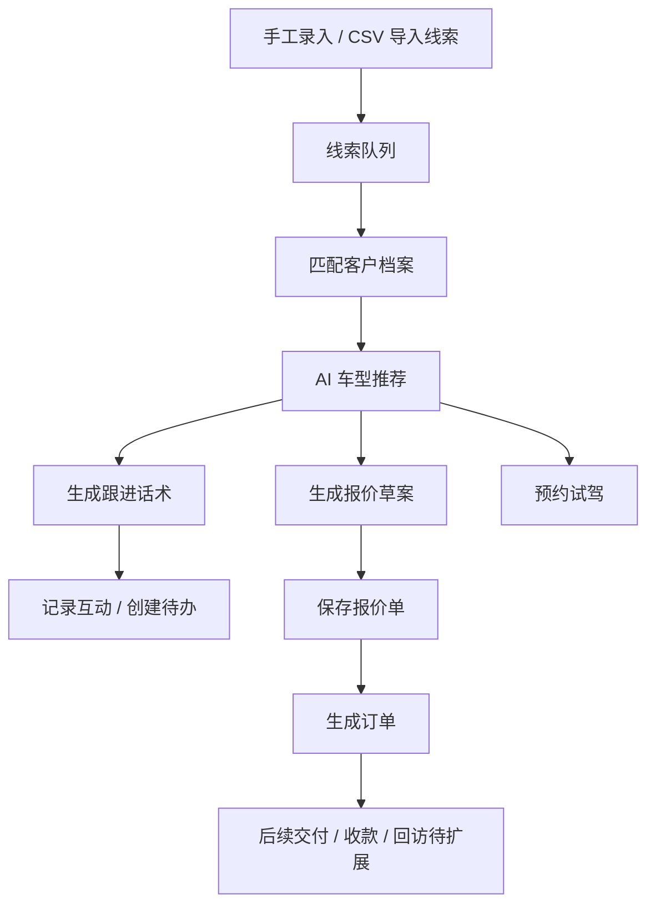

# 汽车销售智能体系统架构

本文档记录当前已实现系统的工程架构、模块边界、数据流和部署形态，用于后续开发、交接和排障。

## 1. 总体架构

当前系统采用单仓库、多应用结构：

- 前端：`apps/web`，React + TypeScript + Vite。
- 后端：`apps/api`，Django + Django REST Framework。
- 数据库：PostgreSQL，Docker Compose 中的 `db` 服务。
- 缓存/异步预留：Redis，Docker Compose 中的 `redis` 服务。
- 部署：Django 容器同时提供 API、Django Admin 和前端 SPA 静态资源。



## 2. 代码结构

```text
apps/
  api/
    apps/
      accounts/       登录会话、用户档案、角色
      tenants/        租户、门店、演示数据种子
      leads/          线索来源、线索、CSV 导入任务
      customers/      客户档案、需求画像、互动、待办
      vehicles/       品牌、车系、车型、配置、库存、销售政策
      sales/          试驾、报价、订单
      ai_gateway/     车型推荐、跟进话术、报价草案
      dashboard/      运营指标汇总
      audit/          审计模型预留
    config/           Django 设置、路由、WSGI/ASGI
  web/
    src/
      App.tsx         主控制台、左侧导航、多业务视图
      services/api.ts 前端 API 客户端和类型定义
```

## 3. 后端模块边界

| 模块 | 职责 | 当前状态 |
| --- | --- | --- |
| `accounts` | Session 登录、当前用户、默认管理员 | 已实现 |
| `tenants` | 集团/门店、多租户基础数据、演示数据 | 已实现基础模型和 seed |
| `leads` | 线索 CRUD、手工录入、CSV 导入 | 已实现 |
| `customers` | 客户、需求画像、互动、待办 | 已实现基础 CRUD |
| `vehicles` | 车型库、库存库、销售政策 | 已实现基础 CRUD |
| `sales` | 试驾、报价、订单及阶段联动 | 已实现轻量闭环 |
| `ai_gateway` | 规则化 AI 能力：推荐、话术、报价 | 已实现结构化 mock/规则引擎 |
| `dashboard` | 首页汇总指标 | 已实现 |
| `audit` | 审计事件模型 | 已建模，业务接入待补 |

## 4. 前端信息架构

当前前端是一个登录后的销售运营控制台，左侧导航包含：

| 导航 | 功能 |
| --- | --- |
| 销售工作台 | 线索队列、客户画像、AI 推荐、报价草案、话术、待办、试驾/报价动作 |
| 获客管理 | 手工录入线索、CSV 导入线索、查看导入任务和最新线索 |
| 客户档案 | 客户列表、预算、意向、标签、下一步动作，支持进入工作台 |
| 车辆资源 | 库存车、VIN、颜色、状态、价格、门店 |
| 报价订单 | 报价单、试驾预约、订单列表，支持报价生成订单 |
| 数据看板 | 线索、客户阶段、试驾、报价、订单、库存汇总 |

## 5. 核心业务数据流

### 5.1 线索到成交闭环



### 5.2 CSV 导入线索

CSV 导入当前为同步处理：

1. 前端上传 CSV 到 `POST /api/leads/imports/`。
2. 后端创建 `LeadImportJob`。
3. 后端解析 CSV，兼容 UTF-8 BOM、GB18030、中文/英文表头。
4. 按 `tenant + phone` 更新或创建 `Lead`。
5. 回写导入任务的 `total_rows`、`imported_rows`、`status`、`error_message`。

支持表头：

- 中文：`姓名`、`手机号`、`城市`、`意向车型`、`预算下限`、`预算上限`、`购车周期`、`评分`、`备注`
- 英文：`name`、`phone`、`city`、`intent_model`、`budget_min`、`budget_max`、`purchase_timeline`、`score`、`notes`

## 6. AI Gateway 设计

当前 `ai_gateway` 是结构化规则能力，不依赖外部大模型：

| 能力 | 接口 | 当前逻辑 |
| --- | --- | --- |
| 车型推荐 | `POST /api/ai/recommendations/vehicles/` | 根据预算、能源、车身类型、库存和政策打分 |
| 跟进话术 | `POST /api/ai/followups/generate/` | 根据场景生成中文话术和要点 |
| 报价草案 | `POST /api/ai/quotes/suggest/` | 按车辆价格、政策、保险、上牌、精品和金融规则生成草案 |

后续接入真实 LLM 时，应保持当前接口结构不变，在 `ai_gateway.services` 内替换为工具编排：

- 意图识别。
- 结构化参数抽取。
- 工具调用白名单。
- 人工确认后落库。
- 调用审计。

## 7. 部署架构

部署包约定：

```text
/mnt/data/cloud_flying/package/auto_sales_agent/git-<sha>/
  image.tar
  docker-compose.yml
  DEPLOYMENT.md
  api.env.example
```

生产部署目录：

```text
/mnt/data/cloud_flying/auto-sales-agent
```

部署命令：

```bash
cd /mnt/data/cloud_flying/auto-sales-agent
DOCKER_BUILDKIT=0 COMPOSE_DOCKER_CLI_BUILD=0 docker compose --env-file apps/api/.env up -d --build
```

启动流程：

1. `wait_for_db`
2. `migrate`
3. `ensure_admin`
4. `seed_demo`
5. `collectstatic`
6. `gunicorn config.wsgi:application --bind 0.0.0.0:7860 --workers 3`

## 8. 关键设计约束

- API 以结构化数据为主，AI 只提供解释、推荐和草案，不直接替代销售顾问确认。
- 价格、库存、报价和订单必须来自结构化数据库。
- 线上 `.env` 不入库，部署时保留服务器已有 `apps/api/.env`。
- `refer_to/` 和本地 `.codex/` 文件不得提交。
- 演示数据种子脚本必须幂等，不能因真实操作产生重复记录而阻塞容器启动。
